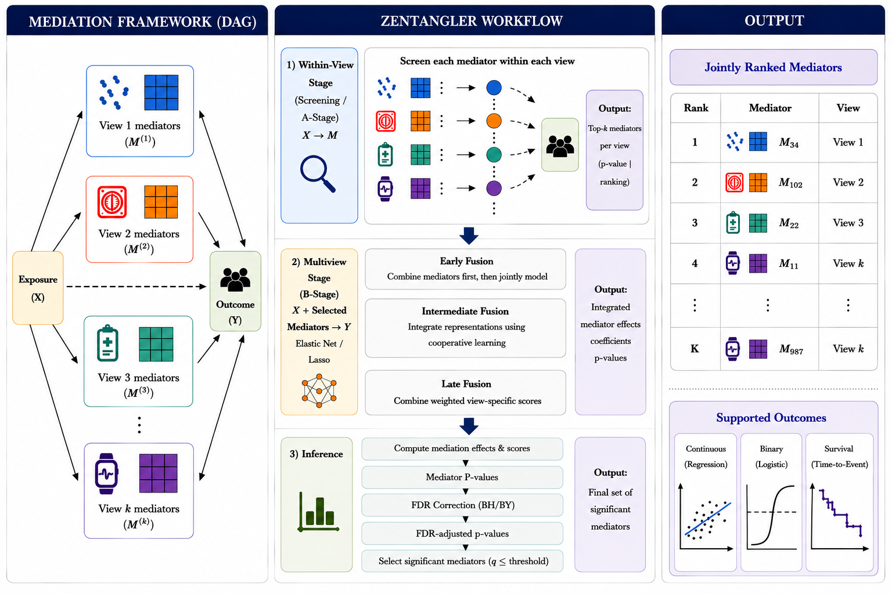

# Zentangler

Zentangler is an R package for **multi-view parallel mediation analysis** with
`MultiAssayExperiment` input.

It is built for studies where one exposure is connected to many candidate
mediators measured across several data modalities, and the goal is to rank
features that may explain the exposure-outcome relationship.

```text
Exposure X -> mediator M in view k -> outcome Y
```

Examples of views include species, KOs, fecal metabolites, plasma metabolites,
transcripts, proteins, methylation features, pathway scores, or any other
numeric assay block.



## Contents

- [Installation](#installation)
- [Core Workflow](#core-workflow)
- [Input Requirements](#input-requirements)
- [Supported Study Designs](#supported-study-designs)
- [Supported Outcomes](#supported-outcomes)
- [Model Components](#model-components)
- [Fusion Techniques](#fusion-techniques)
- [B-Stage Inference](#b-stage-inference)
- [FDR and Active Mediators](#fdr-and-active-mediators)
- [Bootstrap](#bootstrap)
- [Sequential Mediation](#sequential-mediation)
- [Outputs](#outputs)
- [Simulation Examples](#simulation-examples)
- [Function Reference](#function-reference)

## Installation

```r
# install.packages("remotes")
remotes::install_github("himelmallick/Zentangler")
```

## Core Workflow

The main function is:

```r
fit_multiview_parallel_zentangler()
```

A minimal continuous-outcome run:

```r
library(Zentangler)

fit <- fit_multiview_parallel_zentangler(
  mae = mae,
  x_var = "X",
  y_var = "Y",
  y_family = "gaussian",
  method_preset = "fast_lasso",
  sis_n = 50,
  fusion_mode = "early",
  fdr_method = "BH",
  fdr_scope = "global"
)

zentangler_top_mediators(fit, n = 10)
zentangler_view_summary(fit, q_threshold = 0.25)
```

Internally Zentangler does five things:

1. Aligns samples across `MultiAssayExperiment` views.
2. Estimates the A-path for every mediator: `M ~ X + covariates`.
3. Screens mediators within each view.
4. Fits a multiview outcome model: `Y ~ X + selected mediators + covariates`.
5. Scores, ranks, and FDR-adjusts candidate mediators.

The mediation score is:

```text
score = a * b
```

where `a` is the exposure-to-mediator coefficient and `b` is the
mediator-to-outcome coefficient.

## Sequential Mediation

The standard Zentangler API is a parallel mediation model:

```text
X -> M_j -> Y
```

Zentangler separates two model classes:

| Model class | Meaning | API |
|---|---|---|
| `parallel` | One or more mediators modeled as `X -> M -> Y` without mediator-to-mediator links | `fit_multiview_parallel_zentangler()` |
| `sequential` | One explicit ordered route, such as `X -> M1 -> M2 -> Y` | `fit_sequential_zentangler()` |

The k-layer sequential route form is:

```text
X -> M1 -> M2 -> ... -> Mk -> Y
```

In this mode, the first mediator layer is screened by `X -> M1`, adjacent
mediator layers are screened by mediator-to-mediator correlation, retained
links are refit by regression, and each full path is scored as:

```text
sequential_score = a * prod(d_links) * b_terminal
```

The terminal mediator-to-outcome stage supports the same fusion vocabulary as
the parallel API:

| `fusion_mode` | Meaning |
|---|---|
| `"early"` | combine terminal mediators first, then fit one penalized outcome model |
| `"intermediate"` | use the cooperative/intermediate learner across terminal views; requires at least two terminal views and currently supports Gaussian outcomes |
| `"late"` | fit terminal views separately, then combine view-level scores |

Example:

```r
seq_fit <- fit_sequential_zentangler(
  mae = mae,
  x_var = "X",
  y_var = "Y",
  stage_views = list(
    upstream = c("species", "kos"),
    downstream = c("fecal_metabolites", "plasma_metabolites")
  ),
  sis_n = 50,
  cor_method = "spearman",
  min_abs_cor = 0.3,
  cor_q_threshold = 0.25,
  y_family = "gaussian"
)

head(zentangler_sequential_paths(seq_fit), 20)
zentangler_sequential_edges(seq_fit)
zentangler_sequential_terminals(seq_fit)
summarize_sequential_zentangler(seq_fit)
```

Sequential fits expose the same kind of result layers as the parallel API:

| Helper | Returns |
|---|---|
| `zentangler_sequential_paths()` | one row per retained complete path |
| `zentangler_sequential_edges()` | retained adjacent mediator-to-mediator links |
| `zentangler_sequential_terminals()` | terminal mediator-to-outcome coefficients |
| `zentangler_sequential_diagnostics()` | sample counts, path counts, terminal selection counts, bootstrap status |
| `summarize_sequential_zentangler()` | model, threshold, diagnostics, top path, active path, edge, terminal, and causal-effect summaries |

Sequential route discovery still uses correlation screening for adjacent
mediator layers, followed by regression refits for retained transition-link
coefficients. Causal effect summaries are added in a second post-selection
stage, analogous to the parallel API.

The terminal B-stage now supports two public inference modes through
`b_inference`:

```r
b_inference = "debiased"  # de-biased terminal B-stage inference
b_inference = "bootstrap" # repeated B-stage refits with bootstrap p-values
```

To add sequential causal direct/indirect/total effect summaries, use the
post-selection causal layer:

```r
causal_inference = "bootstrap"
```

This computes sequential `effects` / `causal_effects` after route selection and
adds bootstrap summaries for `nde`, `nie_total`, and `te` when
`bootstrap_repeats > 0`.

For uncertainty on the complete path score and on the sequential causal-effect
stage, request a fixed-path bootstrap:

```r
seq_fit_boot <- fit_sequential_zentangler(
  mae = mae,
  x_var = "X",
  y_var = "Y",
  path_templates = list(route = c("species", "fecal_metabolites")),
  sis_n = 50,
  min_abs_cor = 0.3,
  cor_q_threshold = 0.25,
  lambda_choice = "lambda.min",
  b_inference = "debiased",
  path_inference = "bootstrap_score",
  causal_inference = "bootstrap",
  bootstrap_repeats = 100,
  y_family = "gaussian"
)
```

This adds bootstrap path-score means, intervals, selection frequencies, and
bootstrap p-values. With `path_inference = "bootstrap_score"`, those bootstrap
p-values become the final `p_primary` used for path-level q-values. When
`causal_inference = "bootstrap"`, the fit also stores sequential effect
bootstrap summaries in `fit$effects`, `fit$causal_effects`, and
`summarize_sequential_zentangler(fit)$effects`.

For more than two mediator layers, add more entries to `stage_views`. For
example, `list(layer1 = "species", layer2 = "kos", layer3 = "plasma_metabolites")`
fits `X -> layer1 -> layer2 -> layer3 -> Y` paths.

When only one specific biological route should be tested, use `path_templates`.
Zentangler will run only that user-specified route, rather than enumerating all
possible modality combinations. The route must contain at least two modalities.
Run additional routes as separate sequential fits, and use
`fit_multiview_parallel_zentangler()` for pure `X -> M -> Y` mediation.

```r
seq_route <- fit_sequential_zentangler(
  mae = mae,
  x_var = "X",
  y_var = "Y",
  path_templates = list(
    route_1 = c("M1", "M2", "M3") # X -> M1 -> M2 -> M3 -> Y
  ),
  sis_n = 50,
  cor_method = "spearman",
  min_abs_cor = 0.3,
  cor_q_threshold = 0.25
)

head(zentangler_sequential_paths(seq_route), 20)
```

Sequential route fits also support binary and survival outcomes. For binary
outcomes, use a numeric 0/1 outcome column and logistic B-stage inference:

```r
seq_binary <- fit_sequential_zentangler(
  mae = mae,
  x_var = "X",
  y_var = "case_status",
  path_templates = list(route = c("species", "fecal_metabolites")),
  sis_n = 50,
  cor_method = "spearman",
  min_abs_cor = 0.3,
  cor_q_threshold = 0.25,
  fusion_mode = "early",
  lambda_choice = "lambda.min",
  y_family = "binomial",
  b_inference = "debiased"
)

head(zentangler_sequential_paths(seq_binary), 20)
```

For survival outcomes, provide time and event columns. Early and late fusion are
supported; intermediate fusion is currently Gaussian-only.

```r
seq_survival <- fit_sequential_zentangler(
  mae = mae,
  x_var = "X",
  y_var = NULL,
  path_templates = list(route = c("species", "fecal_metabolites")),
  sis_n = 50,
  cor_method = "spearman",
  min_abs_cor = 0.3,
  cor_q_threshold = 0.25,
  fusion_mode = "early",
  lambda_choice = "lambda.min",
  y_family = "survival",
  survival_time_var = "time",
  survival_event_var = "status",
  b_inference = "debiased"
)

head(zentangler_sequential_paths(seq_survival), 20)
```

## Input Requirements

Zentangler expects a `MultiAssayExperiment` where:

- each experiment is one data view
- assays contain numeric features
- sample IDs can be aligned through the MAE sample map
- phenotype/design variables are stored in `colData(mae)`

For `SummarizedExperiment` assays, the usual Bioconductor orientation is:

```text
features x samples
```

Zentangler converts each assay internally to:

```text
samples x features
```

## Supported Study Designs

Zentangler can either use a numeric exposure directly or create a binary exposure
from common study designs.

| Design | `study_design` | Exposure used by model |
| --- | --- | --- |
| Numeric exposure | `"standard"` | `x_var` |
| Case-control | `"case_control"` | case/control indicator |
| Time contrast | `"time"` | comparison time vs reference time |
| Case-control plus time | `"case_control_time"` | case, time, or case-by-time interaction |

### Standard Numeric Exposure

```r
fit <- fit_multiview_parallel_zentangler(
  mae = mae,
  x_var = "X",
  y_var = "Y",
  study_design = "standard"
)
```

### Case-Control

```r
fit_case <- fit_multiview_parallel_zentangler(
  mae = mae,
  y_var = "Y",
  study_design = "case_control",
  case_var = "group",
  control_level = "control",
  case_level = "case"
)
```

### Time-Point Contrast

```r
fit_time <- fit_multiview_parallel_zentangler(
  mae = mae,
  y_var = "Y",
  study_design = "time",
  time_var = "visit",
  time_ref = "T0",
  time_compare = "T1"
)
```

### Case-Control Plus Time

```r
fit_case_time <- fit_multiview_parallel_zentangler(
  mae = mae,
  y_var = "Y",
  study_design = "case_control_time",
  case_var = "group",
  control_level = "control",
  case_level = "case",
  time_var = "visit",
  time_ref = "T0",
  time_compare = "T1",
  exposure_role = "interaction",
  add_design_covariates = TRUE
)
```

For `study_design = "case_control_time"`, `exposure_role` can be:

```r
exposure_role = "case"
exposure_role = "time"
exposure_role = "interaction"
```

## Supported Outcomes

Zentangler supports three outcome families.

| Outcome type | `y_family` | Required inputs | Outcome model |
| --- | --- | --- | --- |
| Continuous | `"gaussian"` | `y_var` | Gaussian / linear model |
| Binary | `"binomial"` | `y_var` | Logistic model |
| Survival | `"survival"` | `survival_time_var`, `survival_event_var` | Cox model |

### Continuous Outcome

```r
fit_continuous <- fit_multiview_parallel_zentangler(
  mae,
  x_var = "X",
  y_var = "Y",
  y_family = "gaussian"
)
```

### Binary Outcome

```r
fit_binary <- fit_multiview_parallel_zentangler(
  mae,
  x_var = "X",
  y_var = "Y",
  y_family = "binomial",
  b_inference = "debiased"
)
```

`y_var` should be numeric and represent the binary outcome.

### Survival Outcome

```r
fit_survival <- fit_multiview_parallel_zentangler(
  mae,
  x_var = "X",
  y_family = "survival",
  survival_time_var = "time",
  survival_event_var = "status",
  fusion_mode = "early",
  b_inference = "debiased"
)
```

For survival outcomes:

- `survival_time_var` must be finite and positive.
- `survival_event_var` must be coded 0/1.
- Early and late fusion are supported.
- Intermediate cooperative fusion is currently Gaussian-only.

## Model Components

Zentangler has three main modeling layers:

1. A-stage: exposure-to-mediator models.
2. Screening: mediator filtering within views.
3. B/Y-stage: multiview outcome model.

### A-Stage Models

| Option | Description |
| --- | --- |
| `a_stage_model = "lm"` | HIMA-like univariate linear A-stage |
| `a_stage_model = "maaslin2"` | MaAsLin2 A-stage with optional random effects |

Default:

```r
a_stage_model = "lm"
```

MaAsLin2 A-stage example:

```r
fit <- fit_multiview_parallel_zentangler(
  mae = mae,
  x_var = "X",
  y_var = "Y",
  a_stage_model = "maaslin2",
  maaslin2_random_effect = "SubjectID",
  maaslin2_normalization = "NONE",
  maaslin2_transform = "NONE",
  maaslin2_analysis_method = "LM"
)
```

### Screening

| Option | Description |
| --- | --- |
| `screen_method = "sis"` | sure independence screening within each view |
| `screen_method = "none"` | keep all usable mediators |

Common screening configuration:

```r
screen_method = "sis"
sis_n = 50
sis_rank = "abs_a"   # or "pvalue"
```

## Fusion Techniques

Fusion controls how selected mediators from multiple views are used in the
outcome model.

| Fusion | `fusion_mode` | Description | Supported outcomes |
| --- | --- | --- | --- |
| Early fusion | `"early"` | concatenate selected mediators from all views into one penalized outcome model | Gaussian, binomial, survival |
| Intermediate fusion | `"intermediate"` | cooperative learning-style view-specific sparse models with agreement penalty | Gaussian |
| Late fusion | `"late"` | fit each view separately, then combine view-level predictions | Gaussian, binomial, survival |

### Early Fusion

```r
fit_early <- fit_multiview_parallel_zentangler(
  mae,
  x_var = "X",
  y_var = "Y",
  fusion_mode = "early"
)
```

Early fusion is often the easiest first model to run and interpret.

### Intermediate Fusion

```r
fit_intermediate <- fit_multiview_parallel_zentangler(
  mae,
  x_var = "X",
  y_var = "Y",
  fusion_mode = "intermediate",
  coop_rho = 0.2
)
```

Intermediate fusion uses a cooperative learning-style update. The `coop_rho`
parameter controls how strongly view-specific fitted signals are encouraged to
agree.

Higher `coop_rho` means stronger agreement pressure. Lower `coop_rho` means each
view can behave more independently.

### Late Fusion

```r
fit_late <- fit_multiview_parallel_zentangler(
  mae,
  x_var = "X",
  y_var = "Y",
  fusion_mode = "late"
)
```

Late fusion is useful when views have very different feature counts or scales.

### Penalization

Early and late fusion use `glmnet`.

```r
glmnet_alpha = 1    # lasso
glmnet_alpha = 0.5  # elastic net
glmnet_alpha = 0    # ridge
```

Lambda choice:

```r
lambda_choice = "lambda.1se"  # more conservative
lambda_choice = "lambda.min"  # less conservative
```

## B-Stage Inference

B-stage inference controls p-values for the mediator-to-outcome coefficient
`b`.

| `b_inference` | Best suited for | Notes |
| --- | --- | --- |
| `"debiased"` | Gaussian, binary, or survival outcomes | de-biased lasso for Gaussian/binomial and Cox active-set Wald approximation for survival |
| `"bootstrap"` | Resampling-based uncertainty | requires `bootstrap_repeats > 0` |

Recommended starting points:

```r
# Any supported outcome, analytic sparse B-stage inference
b_inference = "debiased"

# Any supported outcome, slower but resampling-based
b_inference = "bootstrap"
```

## FDR and Active Mediators

Zentangler stores both global and within-view FDR results.

| Column | Meaning |
| --- | --- |
| `q_primary_global` | FDR across all mediators from all views |
| `q_primary_within_view` | FDR separately inside each view |
| `q_primary` | selected q-value based on `fdr_scope` |

Choose the FDR scope:

```r
fdr_scope = "global"
fdr_scope = "within_view"
```

Choose the correction method:

```r
fdr_method = "BH"  # Benjamini-Hochberg
fdr_method = "BY"  # Benjamini-Yekutieli
```

Inspect active mediators:

```r
zentangler_active_mediators(fit, q_threshold = 0.25)
```

Evaluate several q thresholds without refitting:

```r
summary <- summarize_zentangler(
  fit,
  q_threshold = seq(0.05, 0.25, by = 0.05)
)

summary$threshold_summary
```

## Bootstrap

Bootstrap can add uncertainty summaries and can also be used as the B-stage
inference engine.

```r
fit_boot <- fit_multiview_parallel_zentangler(
  mae,
  x_var = "X",
  y_var = "Y",
  b_inference = "bootstrap",
  bootstrap_repeats = 100
)
```

Bootstrap outputs include:

- `p_b_bootstrap`
- `b_boot_mean`
- `b_boot_sd`
- `b_boot_low`
- `b_boot_high`
- `score_boot_mean`
- `score_boot_sd`
- `score_boot_low`
- `score_boot_high`
- `score_boot_selection_freq`

For repeated-measures data, resample at the subject level:

```r
fit_cluster_boot <- fit_multiview_parallel_zentangler(
  mae,
  x_var = "X",
  y_var = "Y",
  bootstrap_repeats = 100,
  bootstrap_id = "SubjectID"
)
```

## Method Presets

Presets are optional shortcuts for common configurations.

```r
zentangler_method_presets()
```

| Preset | Description |
| --- | --- |
| `custom` | preserve user-supplied options |
| `fast_lasso` | LM A-stage, SIS screening, early-fusion lasso |
| `elastic_net` | LM A-stage, SIS screening, early-fusion elastic net |
| `longitudinal_maaslin2` | MaAsLin2 A-stage, SIS screening, early-fusion lasso |
| `full_exploratory` | LM A-stage, no hard screening, early-fusion elastic net |

## Outputs

The main result table is:

```r
fit$combined_mediators
```

or equivalently:

```r
zentangler_all_mediators(fit)
```

Important fit object fields:

| Field | Description |
| --- | --- |
| `settings` | model settings |
| `diagnostics` | runtime, sample counts, feature counts, screening counts |
| `views` | per-view mediator tables |
| `combined_mediators` | stacked mediator table across all views |
| `mediators_active` | active mediator table using the default q <= 0.25 |
| `mediators_top` | top mediators by absolute score |
| `view_summary` | per-view tested, screened, and active counts |
| `model_summary` | one-row run summary |
| `effects` | direct, indirect, and total-effect-style summaries |
| `effect_decomposition` | direct, indirect, total-effect-style summaries |
| `bootstrap` | bootstrap matrices and failures, if enabled |
| `fits` | fitted model objects if `return_fits = TRUE` |

Important mediator-table columns:

| Column | Description |
| --- | --- |
| `omics` | view name |
| `mediator` | feature name |
| `a` | A-path estimate |
| `p_a`, `q_a` | A-path p-value and q-value |
| `b`, `p_b` | B-path estimate and p-value |
| `score` | `a * b` |
| `abs_score` | absolute score used for ranking |
| `p_primary` | primary mediator evidence p-value |
| `q_primary_global` | global FDR q-value |
| `q_primary_within_view` | within-view FDR q-value |
| `q_primary` | selected q-value based on `fdr_scope` |

Convenience helpers:

```r
zentangler_model_summary(fit)
zentangler_view_summary(fit)
zentangler_top_mediators(fit, n = 20)
zentangler_active_mediators(fit, q_threshold = 0.25)
summarize_zentangler(fit)
```

## Simulation Examples

Zentangler includes SIMMBA/InterSIM-style simulation helpers. These are useful
for testing workflows when the true mediators are known.

### Continuous Simulation

```r
sim <- gen_simmba(
  nsample = 100,
  nrep = 1,
  outcome.type = "continuous",
  ygen.mode = "LM",
  seed = 1
)

fit_continuous <- fit_multiview_parallel_zentangler(
  sim$trainMae[[1]],
  x_var = "A",
  y_var = "Y",
  y_family = "gaussian",
  fusion_mode = "early",
  b_inference = "debiased",
  sis_n = 50,
  screen_method = "sis",
  seed = 1
)

head(zentangler_all_mediators(fit_continuous))
```

### Binary Simulation

```r
sim_binary <- gen_simmba(
  nsample = 100,
  nrep = 1,
  outcome.type = "binary",
  ygen.mode = "LM",
  seed = 1
)

fit_binary <- fit_multiview_parallel_zentangler(
  sim_binary$trainMae[[1]],
  x_var = "A",
  y_var = "Y",
  y_family = "binomial",
  fusion_mode = "early",
  b_inference = "debiased",
  sis_n = 50,
  screen_method = "sis",
  seed = 1
)

head(zentangler_all_mediators(fit_binary))
```

### Survival Simulation

```r
sim_survival <- gen_simmba(
  nsample = 100,
  nrep = 1,
  outcome.type = "survival",
  ygen.mode = "LM",
  seed = 1
)

fit_survival <- fit_multiview_parallel_zentangler(
  sim_survival$trainMae[[1]],
  x_var = "A",
  y_family = "survival",
  survival_time_var = "time",
  survival_event_var = "status",
  fusion_mode = "early",
  b_inference = "debiased",
  sis_n = 50,
  screen_method = "sis",
  seed = 1
)

head(zentangler_all_mediators(fit_survival))
```

### Benchmark Runner

`run_intersim_zentangler()` evaluates recovery across simulation replicates,
fusion modes, q thresholds, and FDR scopes.

```r
res <- run_intersim_zentangler(
  nrep = 10,
  nsample = 1000,
  fusion_modes = c("early", "intermediate", "late"),
  outcome.type = "continuous",
  screen_method = "sis",
  sis_n = 200,
  lambda_choice = "lambda.min",
  glmnet_alpha = 0.5,
  fdr_method = "BH",
  fdr_scope = "both",
  q_threshold = seq(0.05, 0.25, by = 0.05)
)

res$summary
```

Common benchmark metrics:

| Metric | Description |
| --- | --- |
| `n_active` | number of active mediators |
| `true_active` | active mediators that are truly active |
| `false_active` | active mediators that are false positives |
| `precision` | true_active / n_active |
| `recall` | true_active / total true mediators |
| `fdr` | false_active / n_active |
| `top50_true` | number of true mediators among the top 50 ranked mediators |
| `top50_precision` | top50_true / 50 |

## Function Reference

- `fit_multiview_parallel_zentangler()`: fit the multiview mediation model
- `fit_sequential_zentangler()`: fit k-layer sequential mediation paths
- `zentangler_sequential_paths()`: return the sequential path table
- `zentangler_all_mediators()`: return the full mediator table
- `zentangler_top_mediators()`: return top-ranked mediators
- `zentangler_active_mediators()`: return active mediators under a q threshold
- `zentangler_view_summary()`: summarize mediator counts by view
- `zentangler_model_summary()`: summarize model settings and diagnostics
- `summarize_zentangler()`: return model, view, threshold, top, and active summaries
- `zentangler_method_presets()`: inspect named presets
- `gen_simmba()`: generate simulation data with mediation truth
- `run_intersim_zentangler()`: run simulation benchmarks
- `zentangler_truth_key()`: standardize simulation truth tables
- `zentangler_score_truth_recovery()`: score recovery against simulation truth
- `zentangler_summarize_truth_recovery()`: summarize recovery across replicates
- `trigger_InterSIM()`: generate the null InterSIM object used by the simulator
